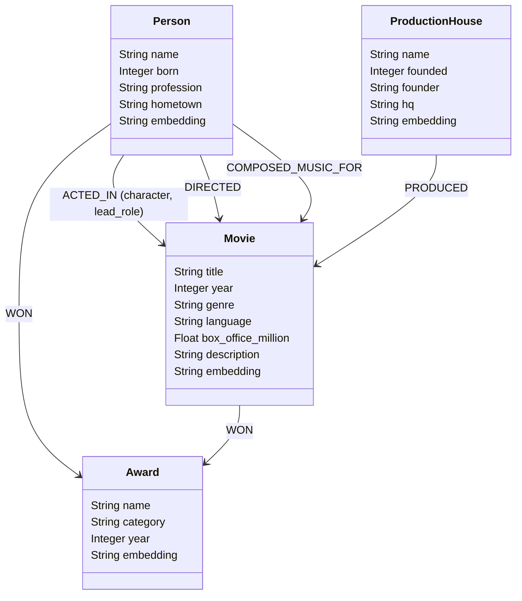
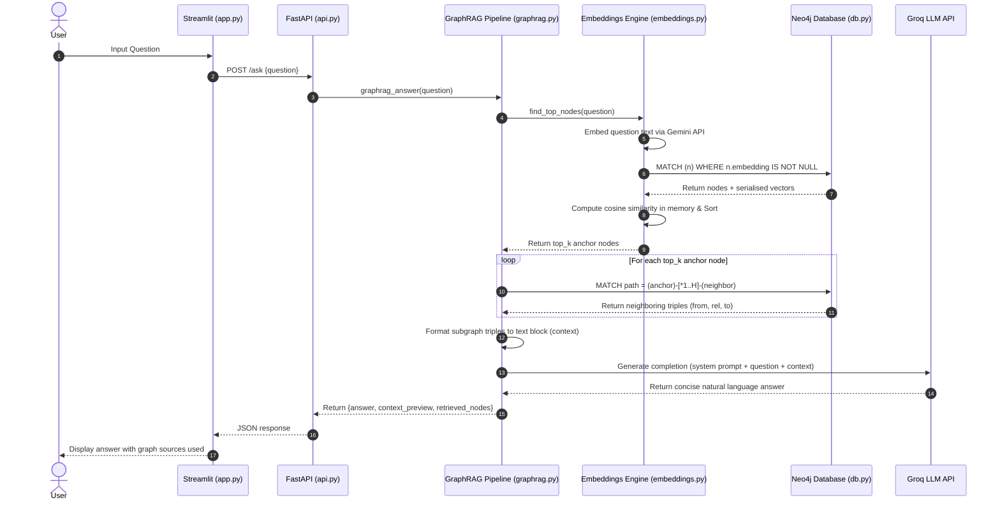

# 🎬 Hollywood GraphRAG: Knowledge Graph-Powered Q&A

Hollywood GraphRAG is a hybrid search and question-answering system that combines the structured relational capabilities of a **Neo4j Graph Database** with the semantic retrieval capabilities of **Google Gemini Vector Embeddings** and the reasoning power of the **Groq Llama 3.3 LLM**.

By linking vector similarity search with graph traversal, this system minimizes hallucinations and provides structured, traceably accurate answers to complex relational questions about Hollywood cinema (1995–2024).

---

## 1. Project Overview

### What the Project Does
This project implements a **Graph-Retrieval Augmented Generation (GraphRAG)** pipeline. It allows users to ask natural language questions about English cinema—including actors, directors, music composers, production houses, awards, and their relationships—and returns a verified, contextual response along with the exact database entities that were used to generate it.

### The Problem It Solves
Traditional RAG systems split text documents into unstructured chunks and retrieve relevant blocks via vector search. While effective for localized summaries, standard RAG struggles with:
1. **Multi-hop reasoning**: For example, answering *"Which actors worked under both Christopher Nolan and Martin Scorsese?"* requires traversing multiple distinct nodes and relationships.
2. **Aggregations & global facts**: Standard RAG often misses the global context of how entities are linked together.
3. **Hallucinations**: When the vector search retrieves irrelevant chunks, the LLM is forced to guess.

### Why GraphRAG is Used
By storing data in a graph schema:
- **Entities** (e.g., `Person`, `Movie`, `ProductionHouse`, `Award`) are nodes.
- **Interactions** (e.g., `ACTED_IN`, `DIRECTED`, `COMPOSED_MUSIC_FOR`, `PRODUCED`, `WON`) are edges.

When a query is received, the system finds the entry-point nodes using vector search, traverses their neighborhoods to capture complex connections (e.g., who directed whom, who won what), formats this structured subgraph into a text context, and feeds it to the LLM. This guarantees that the LLM only reasons over verified facts present in the database.

### Overall Workflow
```
[User Question] ──> [Embed Question] ──> [Vector Search (Python Cosine Similarity)]
                                                     │
                                                     ▼
[LLM Response] <── [Prompt Generator] <── [Subgraph Traversal (Neo4j Hops)]
```

---

## 2. Architecture

The system is split into three main layers: the storage/graph database (Neo4j), the backend API engine (FastAPI + Groq + Gemini API), and the interactive frontend (Streamlit).

### System Communication Flow
```mermaid
graph TD
    User([User])
    Streamlit[Streamlit Frontend (app.py)]
    FastAPI[FastAPI Backend (api.py)]
    GraphRAG[GraphRAG Pipeline (graphrag.py)]
    Embeddings[Gemini Embeddings Engine (embeddings.py)]
    Neo4j[(Neo4j Graph DB)]
    Groq[Groq LLM Engine (Llama 3.3)]

    User <-->|HTTP / Streamlit| Streamlit
    Streamlit <-->|JSON over HTTP| FastAPI
    FastAPI <-->|Python Call| GraphRAG
    GraphRAG <-->|Embed Query| Embeddings
    GraphRAG <-->|Fetch Subgraph / Cypher| Neo4j
    GraphRAG <-->|Structured Context| Groq
    Embeddings <-->|Google GenAI SDK| Gemini[Google Gemini API]
```

---

## 3. Explanation of Every File

### `src/db.py`
- **Purpose**: Implements a thread-safe connection wrapper around the official Neo4j Python driver.
- **Responsibilities**: Manages connection pools, handles database connectivity verification, and exposes simple APIs for read, write, and batch operations.
- **Main Classes/Functions**:
  - `Neo4jConnection`: The main wrapper class.
    - `__init__(uri, user, password)`: Connects to the database and calls `verify_connectivity()`. Falls back to environment variables.
    - `write(query, params)`: Executes a write query in a database session.
    - `read(query, params)`: Executes a read query and returns a list of dictionaries.
    - `write_batch(query, rows, batch_size)`: Executes bulk writes using Neo4j's `UNWIND` feature for optimized transaction processing.
- **Dependencies**: `neo4j`, `dotenv`, `os`, `typing`.

### `src/embeddings.py`
- **Purpose**: Computes Google text embeddings for each graph node and computes cosine similarity for retrieval.
- **Responsibilities**: Translates structured graph nodes into descriptive natural language sentences, calls the Google GenAI API to generate embedding vectors, stores them as JSON properties on nodes, and performs similarity searches.
- **Main Classes/Functions**:
  - `node_to_text(props: dict, label: str) -> str`: Formulates a natural language sentence from a node's properties based on its label.
  - `embed_batch(texts: list[str]) -> list[list[float]]`: Sends batch requests of up to 25 texts to the Google Embeddings API, with automatic exponential backoff rate-limit handling.
  - `add_embeddings(db: Neo4jConnection)`: Identifies all nodes lacking embeddings, generates them, and writes them back.
  - `cosine_similarity(a, b)`: Computes the cosine similarity metric between two vectors using NumPy.
  - `find_top_nodes(question, db, top_k, labels)`: Embeds the user question, retrieves candidate nodes from Neo4j, calculates similarity in memory, and returns the top $K$ matches.
- **Dependencies**: `google-genai`, `numpy`, `dotenv`, `db.py`.

### `src/loader.py`
- **Purpose**: Prepares database constraints and uploads the complete static dataset into Neo4j.
- **Responsibilities**: Configures uniqueness constraints on node names/titles and bulk-inserts nodes and relationships idempotently using Cypher `MERGE` queries.
- **Main Classes/Functions**:
  - `setup_constraints(db)`: Creates uniqueness constraints on `:Person(name)`, `:Movie(title)`, `:ProductionHouse(name)`, and `:Award(name)`.
  - `load_people(db)`, `load_movies(db)`, `load_production_houses(db)`, `load_awards(db)`: Upserts the corresponding nodes.
  - `load_acted_in(db)`, `load_directed(db)`, `load_composed(db)`, `load_produced_by(db)`, `load_won_awards(db)`: Establishes directed relationships between existing nodes.
  - `load_all(db, clear_first)`: Orchestrates the constraints and imports.
- **Dependencies**: `db.py`, `src/data/hollywood_data.py`.

### `src/graphrag.py`
- **Purpose**: Manages the multi-step GraphRAG pipeline from query to LLM response.
- **Responsibilities**: Orchestrates the retrieval of top nodes, triggers graph traversals, serializes the subgraphs into readable text context, and constructs the LLM prompts.
- **Main Classes/Functions**:
  - `retrieve_subgraph(node_name, node_label, db, hops) -> dict`: Uses Cypher to crawl paths within $N$ hops of the starting node, outputting a list of edge triples.
  - `subgraph_to_context(subgraph: dict) -> str`: Converts a subgraph dict into an LLM-friendly text format while filtering out database-specific properties.
  - `generate_answer(question, context) -> str`: Sends a structured prompt to the Groq API using the `llama-3.3-70b-versatile` model.
  - `graphrag_answer(question, db, top_k, hops, verbose) -> dict`: Evaluates the entire pipeline.
- **Dependencies**: `groq`, `dotenv`, `db.py`, `embeddings.py`.

### `src/api.py`
- **Purpose**: Provides a REST API using FastAPI.
- **Responsibilities**: Exposes HTTP endpoints for frontend consumption, performs validation on incoming request payloads, and handles exceptions.
- **Main Classes/Functions**:
  - `QuestionRequest` / `QuestionResponse` / `CypherRequest`: Pydantic schemas.
  - `POST /ask`: Answers a question using the GraphRAG pipeline.
  - `GET /search`: Returns vector search results.
  - `GET /graph/{entity_name}`: Returns the neighborhood subgraph context.
  - `GET /stats`: Returns database node/relationship counts.
  - `POST /cypher`: Executes read-only cypher MATCH statements.
  - `GET /movies`: Lists movies sorted by box office.
  - `GET /person/{name}/filmography`: Returns structured information about a person.
- **Dependencies**: `fastapi`, `pydantic`, `uvicorn`, `db.py`, `graphrag.py`, `embeddings.py`.

### `src/app.py`
- **Purpose**: Streamlit-based interactive web interface.
- **Responsibilities**: Renders a multipage dashboard allowing users to chat, explore entity subgraphs, browse movie metadata, and inspect graph statistics.
- **Dependencies**: `streamlit`, `httpx`, `dotenv`.

---

## 4. Data Flow

The lifecycle of loading data and retrieving answers follows an exact sequence:

```
[Static Data Source]
        │
        ▼
1. Uniqueness Constraints Set (loader.py)
        │
        ▼
2. Nodes & Relationships Created (MERGE queries in loader.py)
        │
        ▼
3. Node Properties Exported -> Natural Language Description (node_to_text)
        │
        ▼
4. Google Gemini API Call -> 768-dim Embedding Vector (embeddings.py)
        │
        ▼
5. Embeddings JSON-serialized and written to n.embedding (embeddings.py)
        │
        ▼
6. User Question -> Embedded to Query Vector (graphrag.py)
        │
        ▼
7. Cosine Similarity vs. All Node Embeddings in memory (embeddings.py)
        │
        ▼
8. Cypher Hop Traversal up to 2-3 hops around top nodes (graphrag.py)
        │
        ▼
9. Subgraph Triples compiled into structured textual context (graphrag.py)
        │
        ▼
10. System Prompt & Context fed to Groq Llama 3.3 (graphrag.py)
        │
        ▼
11. Final Response returned to user
```

---

## 5. Graph Schema

The schema contains 4 Node labels and 5 Relationship types.

### Node Labels
- **`Movie`**: Represents film entities. Properties: `title`, `year`, `genre`, `language`, `box_office_million`, `description`, `embedding`, `embedding_text`.
- **`Person`**: Represents actors, directors, and music composers. Properties: `name`, `born`, `profession`, `hometown`, `embedding`, `embedding_text`.
- **`ProductionHouse`**: Represents film studios. Properties: `name`, `founded`, `founder`, `hq`, `embedding`, `embedding_text`.
- **`Award`**: Represents industry accolades. Properties: `name`, `category`, `year`, `embedding`, `embedding_text`.

### Relationship Types
- **`ACTED_IN`**: Connects `Person` to `Movie`. Properties: `character`, `lead_role` (boolean).
- **`DIRECTED`**: Connects `Person` to `Movie`.
- **`COMPOSED_MUSIC_FOR`**: Connects `Person` to `Movie`.
- **`PRODUCED`**: Connects `ProductionHouse` to `Movie`.
- **`WON`**: Connects `Person` or `Movie` to `Award`.

### Schema Visualization


---

## 6. Embedding Pipeline

1. **Generation Source**: 
   Every node in the graph is translated into a natural language sentence via `node_to_text()`.
   - *Example Movie Sentence*: `'Inception' is a Science Fiction Thriller English film released in 2010. A skilled thief enters dreams to steal secrets and is offered a chance to erase his past by planting an idea.`
2. **Vector Generation**: 
   The generated text is passed to the Gemini Embedding model (`gemini-embedding-001`) via the Google GenAI SDK, which returns a **768-dimensional float array**.
3. **Storage Strategy**: 
   Because this application runs on Neo4j Community Edition (which lacks native vector index definitions out of the box in standard configs), vectors are stored as **JSON strings** under the node property `embedding`.
4. **Similarity Search Mechanics**:
   - The query text is embedded using `gemini-embedding-001`.
   - The system retrieves all nodes from Neo4j that have an `embedding` property.
   - The string is deserialized into a Python list of floats.
   - NumPy calculates the Cosine Similarity:
     $$\text{similarity} = \frac{A \cdot B}{\|A\| \|B\| + 10^{-9}}$$
   - Nodes are sorted in descending order of similarity score.

---

## 7. Retrieval Pipeline

```
[User Query]
    │
    ▼
1. Embed Query (embeddings.py)
    │
    ▼
2. Compare with all nodes -> Select Top-K anchors (default=3)
    │
    ▼
3. Run Cypher Traversal for each anchor up to N hops (default=2)
   "MATCH (start) WHERE start.name = $name OPTIONAL MATCH path = (start)-[*1..H]-(neighbor)..."
    │
    ▼
4. Collect paths & extract edges as structured triples: (from, rel, to)
    │
    ▼
5. Filter duplicate edges & serialize properties (excluding embedding strings)
    │
    ▼
6. Inject Context into Llama-3.3 prompt & enforce "no hallucination" constraints
    │
    ▼
7. Deliver final response to Streamlit UI
```

---

## 8. API Documentation

### `GET /health`
- **Description**: Verifies database connectivity.
- **Response Status**: `200 OK` or `503 Service Unavailable`
- **Response JSON**:
  ```json
  {
    "status": "ok",
    "node_count": 142
  }
  ```

### `POST /ask`
- **Description**: Executes the complete GraphRAG pipeline.
- **Request Body**:
  ```json
  {
    "question": "Which movies did Christopher Nolan direct?",
    "top_k": 3,
    "hops": 2
  }
  ```
- **Response JSON**:
  ```json
  {
    "question": "Which movies did Christopher Nolan direct?",
    "answer": "Christopher Nolan directed 'Inception', 'Batman Begins', 'The Dark Knight', 'The Dark Knight Rises', 'Interstellar', and 'Oppenheimer'.",
    "retrieved_nodes": [
      {
        "name": "Christopher Nolan",
        "label": "Person",
        "score": 0.8124
      }
    ],
    "context_preview": "ENTITY: Christopher Nolan [Person]..."
  }
  ```

### `GET /search`
- **Description**: Simple vector search.
- **Query Params**: `q` (required), `top_k` (optional, default 5), `label` (optional)
- **Response JSON**:
  ```json
  {
    "query": "superhero",
    "results": [
      {
        "label": "Movie",
        "name": "The Dark Knight",
        "score": 0.7421
      }
    ]
  }
  ```

### `GET /graph/{entity_name}`
- **Description**: Returns the neighborhood subgraph of an entity.
- **Path Params**: `entity_name` (e.g. `Inception`)
- **Query Params**: `label` (default `Movie`), `hops` (default 2)
- **Response JSON**:
  ```json
  {
    "entity": "Inception",
    "label": "Movie",
    "context": "ENTITY: Inception [Movie]\nProperties: year=2010...\nCONNECTIONS:\n  • Christopher Nolan -[DIRECTED]-> Inception"
  }
  ```

### `GET /stats`
- **Description**: Returns database statistics.
- **Response JSON**:
  ```json
  {
    "nodes": [
      {
        "label": "Person",
        "count": 92
      }
    ],
    "relationships": [
      {
        "rel_type": "ACTED_IN",
        "count": 89
      }
    ]
  }
  ```

### `POST /cypher`
- **Description**: Executes raw MATCH query.
- **Request Body**:
  ```json
  {
    "query": "MATCH (m:Movie) RETURN m.title LIMIT 2"
  }
  ```
- **Response JSON**:
  ```json
  {
    "results": [
      {
        "m.title": "Inception"
      }
    ],
    "count": 1
  }
  ```

---

## 9. Installation Guide

### Prerequisites
- Python 3.10+
- An active Neo4j database instance (Aura Cloud or Local Desktop)
- Gemini API Key
- Groq API Key

### Step 1: Clone the Project
```bash
git clone <repository_url>
cd GraphRAG
```

### Step 2: Set Up Virtual Environment
```bash
python -m venv venv
# Windows:
.\venv\Scripts\activate
# macOS/Linux:
source venv/bin/activate
```

### Step 3: Install Dependencies
```bash
pip install -r requirements.txt
```

### Step 4: Configure Environment Variables
Create a `.env` file in the root directory:
```env
NEO4J_URI="neo4j+s://<your-db-id>.databases.neo4j.io"
NEO4J_USERNAME="neo4j"
NEO4J_PASSWORD="your-strong-password"
GROQ_API_KEY="gsk_..."
GEMINI_API_KEY="AIzaSy..."
API_URL="http://localhost:8000"
```

### Step 5: Seed the Neo4j Database
Run the loader script to populate the graph with the Hollywood dataset:
```bash
python src/loader.py
```

### Step 6: Generate Node Embeddings
Compute and write embeddings to all loaded nodes:
```bash
python src/embeddings.py
```

### Step 7: Launch the API Backend
```bash
python src/api.py
```

### Step 8: Launch the Streamlit Frontend
In a new terminal window (with the virtual environment activated):
```bash
streamlit run src/app.py
```
Open `http://localhost:8501` in your browser.

---

## 10. Environment Variables

| Variable Name | Description | Required | Default Value |
| :--- | :--- | :--- | :--- |
| `NEO4J_URI` | Bolt connection string for Neo4j instance | Yes | `bolt://localhost:7687` |
| `NEO4J_USERNAME` | Username for database auth | Yes | `neo4j` |
| `NEO4J_PASSWORD` | Password for database auth | Yes | `password` |
| `GROQ_API_KEY` | API Key for Llama-3.3-70b-versatile access | Yes | N/A |
| `GEMINI_API_KEY` | API Key for google-genai embedding client | Yes | N/A |
| `API_URL` | Base endpoint of backend FastAPI service | No | `http://localhost:8000` |

---

## 11. Folder Structure

```
GraphRAG/
├── data/
│   └── (optional folder for raw source logs or docs)
├── src/
│   ├── data/
│   │   ├── __init__.py
│   │   └── hollywood_data.py    # Main static dataset dictionary definitions
│   ├── api.py                  # FastAPI server and endpoints
│   ├── app.py                  # Streamlit frontend application
│   ├── db.py                   # Thread-safe Neo4j driver connection manager
│   ├── embeddings.py           # Gemini embeddings engine & vector similarity logic
│   └── graphrag.py             # Context synthesis and Groq LLM pipelines
├── .env                        # Local credentials config (gitignored)
├── requirements.txt            # Python dependencies lists
└── README.md                   # System documentation
```

---

## 12. Sequence Diagram



---

## 13. Error Handling

- **Neo4j Connectivity**: Explicitly handles connection failures by calling `.verify_connectivity()` on driver initialization. If the DB is offline, the API's `/health` endpoint raises an HTTP 503 error, and the Streamlit sidebar displays a clear warning.
- **Embedding Rate Limits (HTTP 429)**: The `embed_batch` routine checks for error strings containing `429`, `RESOURCE_EXHAUSTED`, or `quota`. It performs up to 6 retries using exponential backoff starting at 5 seconds.
- **Missing Environment Variables**: Handled using `os.getenv` fallback values or explicitly rising key errors (e.g. `os.environ.get("GROQ_API_KEY")` returning `None` which is passed directly to client instantiation).
- **Invalid REST Requests**: Validation is fully managed by FastAPI's Pydantic model integration. Out of bound values for `top_k` (>10) or `hops` (>4) trigger automatic `422 Unprocessable Entity` responses.
- **LLM Failures**: If Groq is unavailable, the pipeline catches generic runtime exceptions inside the API router functions and translates them to HTTP 500 responses with the exact message traceback.

---

## 14. Performance Considerations

- **Unwinding Database Batch Writes**: In `db.py`, `write_batch()` optimizes transactional overhead by breaking large arrays into sizes of 200 elements and committing them via Cypher `UNWIND`.
- **In-Memory Similarity Computation**: For small datasets (100–1000 nodes), retrieving all embeddings to calculate similarity in Python is extremely fast (~5-10ms).
- **Node Constraints**: Setting unique constraints on `Person.name` and `Movie.title` ensures that `MATCH (n) WHERE n.name = $name` utilizes indexing instead of scanning the entire database.

---

## 15. Future Improvements

1. **Native Neo4j Vector Indexes**: Migrate from in-memory cosine calculations to Neo4j Enterprise native vector indexes (`db.index.vector.createNodeIndex`), offloading similarity scoring directly to the database.
2. **Community Detection (Leiden/Louvain)**: Group the graph nodes into hierarchical communities using the Graph Data Science (GDS) library to summarize high-level topics rather than relying purely on localized path hops.
3. **Dynamic Entity Resolution**: Integrate an Entity Extraction model (NER) in the query step to map entities to graph nodes with fuzzy spelling or aliases, reducing reliance on strict embedding similarity.
4. **Graph-native caching**: Cache recurring query subgraphs to eliminate redundant database sessions.

---

## 16. License & Contributing

Licensed under the MIT License. Contributions are welcome! Please open an issue or pull request to discuss improvements.
